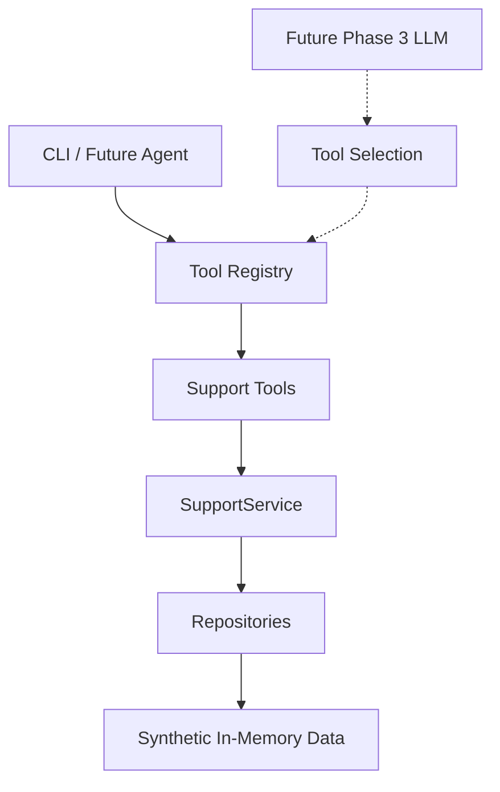
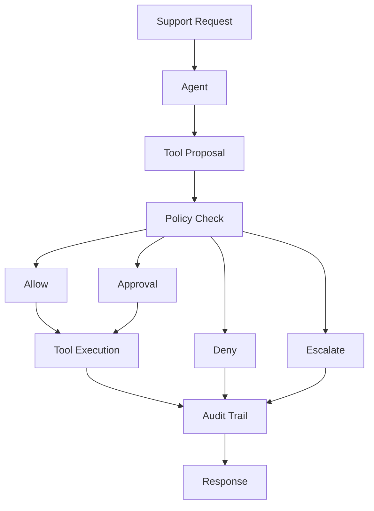

# SupportOps Agent

A local-first AI support operations agent focused on tool calling, policy enforcement, human approval, auditability, and safe automated actions.

## Overview

SupportOps Agent is an original portfolio and client-demo project for exploring how AI agents can support operational customer workflows without becoming an unsafe chatbot-only wrapper. Phase 1 built the core agent and tool foundation. Phase 2 adds a completely synthetic Northstar Commerce support backend with deterministic in-memory data, repository abstractions, real support-oriented tools, idempotent refund behavior, and rollback foundations.

The AI agent does not autonomously select or execute tools yet. Phase 2 allows manual controlled tool execution through the CLI only.

## Why Agentic Support Operations

Support operations often require more than a generated answer. A useful agent must inspect context, propose actions, evaluate risk, route uncertain cases to people, preserve an audit trail, and recover cleanly when tools fail. This project builds those mechanics deliberately before adding orchestration frameworks.

## Project Goals

- Understand customer support requests.
- Inspect customer and order context through explicit tools.
- Select tools through structured contracts.
- Check proposed actions against policy.
- Request human approval for risky actions.
- Execute safe actions only when allowed.
- Escalate when uncertain or unsafe.
- Maintain audit events for every important step.
- Support deterministic evaluation and failure recovery.

## Architecture

Current Phase 2 data flow:



Future target loop:



## Synthetic Support Backend

Phase 2 introduces fictional Northstar Commerce records only:

- Customers
- Orders and order items
- Support tickets
- Refund records
- Refund policy data

All normal CLI runs start from deterministic seed data. Writes mutate in-memory state only inside the current process.

## Domain Model Overview

- `Customer`: synthetic customer identity, status, and metadata.
- `Order`: customer order with Decimal monetary values, delivery state, refund totals, and remaining refundable amount.
- `SupportTicket`: ticket state, priority, resolution, and customer/order association.
- `RefundRecord`: completed refund or reversal record with idempotency key and rollback relationship fields.
- `RefundPolicy`: stored synthetic policy data for return windows, refund thresholds, and allowed reasons.

## Fictional Dataset

Key records include:

- Jordan Lee, `CUS-1001`, `jordan.lee@example.test`
- `ORD-1001`, Wireless Headphones, `79.99 USD`, delivered on `2026-09-12`
- Morgan Chen, `CUS-1002`, with `ORD-1002`, Laptop Docking Station, `299.99 USD`
- A high-value `749.99 USD` order for future escalation scenarios
- An order outside the 30-day return window
- A shipped but not delivered order
- A multi-item order for future partial refund logic

The example request remains: "My headphones arrived damaged. Can I get a refund?"

## Repository Abstractions

The backend uses repository interfaces for customers, orders, tickets, refunds, and policies. Phase 2 ships deterministic in-memory implementations:

- `InMemoryCustomerRepository`
- `InMemoryOrderRepository`
- `InMemoryTicketRepository`
- `InMemoryRefundRepository`
- `InMemoryPolicyRepository`

Repositories return copies and do not expose internal dictionaries to callers.

## SupportService

`SupportService` provides deterministic business-data access and controlled mutations:

- Customer lookup by ID or email
- Order lookup and customer order listing
- Ticket lookup and customer ticket listing
- Refund policy lookup
- Refund history lookup
- Ticket creation and status updates
- Controlled refund issuance
- Controlled refund reversal

No LLM logic lives in this service.

## Support Tools

| Tool | Risk | Purpose |
| --- | --- | --- |
| `customer_lookup` | READ_ONLY | Fetch synthetic customer by ID |
| `customer_lookup_by_email` | READ_ONLY | Fetch synthetic customer by email |
| `order_lookup` | READ_ONLY | Fetch synthetic order details |
| `list_customer_orders` | READ_ONLY | List orders for a customer |
| `refund_policy_lookup` | READ_ONLY | View refund policy |
| `ticket_lookup` | READ_ONLY | Fetch a support ticket |
| `create_ticket` | LOW_RISK_WRITE | Create a synthetic support ticket |
| `update_ticket_status` | LOW_RISK_WRITE | Update synthetic ticket status |
| `issue_refund` | HIGH_RISK_WRITE | Issue controlled synthetic refund |
| `reverse_refund` | HIGH_RISK_WRITE | Create a synthetic refund reversal record |

`EchoTool` remains tests-only and is not registered in the default support registry.

## Read vs Write Risk

Read tools can be called from the CLI without confirmation. Write tools require `--confirm-write` when using the generic `--tool` command. This prevents accidental ticket updates or refund simulations during manual testing.

## Idempotency

`issue_refund` requires an idempotency key. Reusing the same key with the same inputs returns the existing refund and does not change monetary totals again. Reusing a key with conflicting inputs raises a clean domain error.

## Refund Integrity

Refund simulation enforces data-integrity rules:

- Order must exist.
- Amount must be greater than zero.
- Amount cannot exceed remaining refundable amount.
- Non-refundable order states are rejected.
- Completed refunds update `refund_total`.
- Full refunds set order status to `refunded`.
- Partial refunds set order status to `partially_refunded`.
- Decimal is used for all money values.

Policy thresholds are stored and visible but are not centrally enforced yet. Policy enforcement comes in Phase 4.

## Rollback / Reversal Foundation

`reverse_refund` creates an audit-friendly reversal record and links the original refund through `reversed_by_refund_id`. It restores the order refund total without deleting financial history. Double reversal is prevented.

## Policy Decisions

Policy models currently support:

- `ALLOW`
- `REQUIRE_APPROVAL`
- `DENY`
- `ESCALATE`

The policy engine itself is planned for a later phase.

## Human Approval

Approval models define pending, approved, denied, and expired decisions. They are ready for future human-in-the-loop workflows, but no approval execution service is included in Phase 2.

## Audit Trail

Audit event models are append-only style domain objects for request receipt, model calls, tool selection, tool execution, policy checks, approvals, escalation, completion, and failure. Persistence is planned for a later phase.

## Technology Stack

Runtime:

- Python 3.12+
- uv
- Ollama
- OpenAI-compatible Ollama endpoint
- OpenAI Python SDK
- Pydantic
- pydantic-settings
- python-dotenv

Development:

- pytest
- Ruff

## Quick Start

```bash
uv sync
uv run pytest
uv run ruff check .
uv run python -m app.main --list-tools
```

Create a local `.env` from `.env.example` if you want to override defaults.

## CLI

Health check:

```bash
uv run python -m app.main
```

List support tools:

```bash
uv run python -m app.main --list-tools
```

Customer lookup:

```bash
uv run python -m app.main --customer CUS-1001
```

Order lookup:

```bash
uv run python -m app.main --order ORD-1001
```

Refund policy:

```bash
uv run python -m app.main --refund-policy
```

Safe read tool call:

```bash
uv run python -m app.main --tool customer_lookup --input "{\"customer_id\":\"CUS-1001\"}"
```

Controlled write tool call:

```bash
uv run python -m app.main --tool issue_refund --input "{\"order_id\":\"ORD-1001\",\"amount\":\"10.00\",\"reason\":\"damaged\",\"idempotency_key\":\"refund-ORD-1001-demo-001\"}" --confirm-write
```

Without `--confirm-write`, write tools refuse execution.

Safe LLM smoke prompt with the default model:

```bash
uv run python -m app.main --llm-test
```

Safe LLM smoke prompt with model override:

```bash
uv run python -m app.main --llm-test --model gemma3
```

## Current Phase 2 Capabilities

- Phase 1 agent and tool foundation.
- Synthetic Northstar Commerce support backend.
- Deterministic in-memory repository implementations.
- Customer, order, ticket, refund, and policy models.
- SupportService for deterministic data access and controlled mutations.
- Real support tools registered through the existing ToolRegistry.
- Manual CLI tool execution with write confirmation gates.
- Idempotent refund behavior.
- Refund reversal foundation.
- Comprehensive unit tests that do not require live Ollama, internet, external APIs, or databases.

## Planned Roadmap

1. Agent foundation & tool contracts [x]
2. Synthetic support backend [x]
3. Tool calling & agent decision loop
4. Policy enforcement, approvals & audit trail
5. Agent evaluation & failure recovery
6. FastAPI backend
7. Gradio operations console
8. Observability, deployment & portfolio release

## Client Demo Direction

The eventual synthetic demo will use:

- Customer: Jordan Lee
- Order: ORD-1001
- Product: Wireless Headphones
- Order value: $79.99
- Possible request: "My headphones arrived damaged. Can I get a refund?"

Future behavior:

- Look up customer.
- Look up order.
- Inspect refund policy.
- Determine risk.
- Propose refund.
- Auto-execute if below the configured threshold and policy allows.
- Require approval for larger refunds.
- Audit every step.

The synthetic backend now exists, but the autonomous agent decision loop is not implemented in Phase 2.

## Security / Privacy

All records are synthetic. Do not include real customer names tied to private data, real email addresses, real orders, support tickets, payment information, authentication secrets, or payment processor credentials.

The project uses `example.test` email addresses only. Refund behavior is simulated in memory. No card data, payment processor integration, database, or external support API is used.

The repository ignores `.env`, `.venv/`, caches, `runtime/`, `data/`, and log files.
