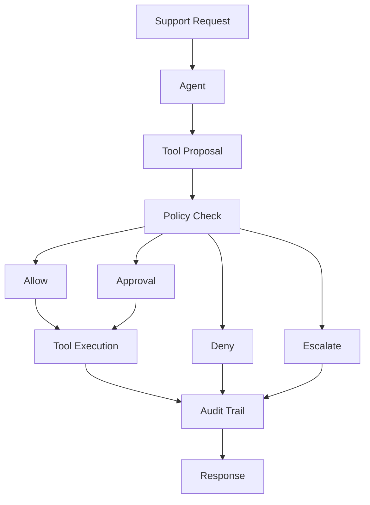

# SupportOps Agent

A local-first AI support operations agent focused on tool calling, policy enforcement, human approval, auditability, and safe automated actions.

## Overview

SupportOps Agent is an original portfolio and client-demo project for exploring how AI agents can support operational customer workflows without becoming an unsafe chatbot-only wrapper. Phase 1 builds the core Python foundation: configuration, LLM provider abstraction, agent state models, tool contracts, policy and approval models, audit events, health checks, CLI smoke tests, and unit tests.

This phase intentionally does not include real customer systems, order storage, refund actions, FastAPI, Gradio, LangChain, or LangGraph.

## Why Agentic Support Operations

Support operations often require more than a generated answer. A useful agent must inspect context, propose actions, evaluate risk, route uncertain cases to people, preserve an audit trail, and recover cleanly when tools fail. This project is designed around those mechanics from the beginning.

## Project Goals

- Understand customer support requests.
- Inspect customer and order context through explicit tools.
- Select tools through structured contracts.
- Check proposed actions against policy.
- Request human approval for risky actions.
- Execute safe actions only when allowed.
- Escalate when uncertain or unsafe.
- Maintain audit events for every important step.
- Support deterministic evaluation and failure recovery.

## Architecture

The full loop below is the future target architecture. Phase 1 implements the domain foundation and CLI checks, not the full reasoning or execution loop.



## Safety Model

Future agent actions will use least privilege, explicit tool schemas, risk levels, policy checks, approval gates, reversible operations, audit events, and escalation when uncertain. Phase 1 prepares these concepts as domain models and contracts; it does not claim that full runtime enforcement is implemented yet.

## Tool Contracts

Tools expose:

- Name
- Description
- Pydantic input model
- Pydantic output model
- Risk level
- Structured execution result
- Model-friendly JSON schema

Phase 1 includes an internal `EchoTool` for tests and optional CLI smoke checks only. It is not a support business tool.

## Policy Decisions

Policy models currently support:

- `ALLOW`
- `REQUIRE_APPROVAL`
- `DENY`
- `ESCALATE`

The policy engine itself is planned for a later phase.

## Human Approval

Approval models define pending, approved, denied, and expired decisions. They are ready for future human-in-the-loop workflows, but no approval execution service is included in Phase 1.

## Audit Trail

Audit event models are append-only style domain objects for request receipt, model calls, tool selection, tool execution, policy checks, approvals, escalation, completion, and failure. Persistence is planned for a later phase.

## Technology Stack

Runtime:

- Python 3.12+
- uv
- Ollama
- OpenAI-compatible Ollama endpoint
- OpenAI Python SDK
- Pydantic
- pydantic-settings
- python-dotenv

Development:

- pytest
- Ruff

## Quick Start

```bash
uv sync
uv run pytest
uv run ruff check .
uv run python -m app.main
```

Create a local `.env` from `.env.example` if you want to override defaults.

## CLI

Health check:

```bash
uv run python -m app.main
```

Safe LLM smoke prompt with the default model:

```bash
uv run python -m app.main --llm-test
```

Safe LLM smoke prompt with model override:

```bash
uv run python -m app.main --llm-test --model gemma3
```

List registered tools:

```bash
uv run python -m app.main --list-tools
```

Run the explicit internal demo tool:

```bash
uv run python -m app.main --tool-test echo
```

## Current Phase 1 Capabilities

- Python package structure.
- Pydantic settings with Ollama and future policy thresholds.
- OpenAI-compatible Ollama provider abstraction.
- Clean LLM provider errors for unavailable service, connection failure, missing model, empty response, and malformed response.
- Agent request, message, state, status, and result models.
- Tool base contract, tool result model, registry, and schema generation.
- Risk-level model for read-only, low-risk write, and high-risk write tools.
- Policy decision and proposed action models.
- Human approval request and decision models.
- Reversibility fields for proposed actions and tool results.
- Audit event models.
- Health service.
- CLI smoke commands.
- Unit tests that do not require live Ollama, internet, or external APIs.

## Planned Roadmap

1. Agent foundation & tool contracts ✅
2. Synthetic support backend
3. Tool calling & agent decision loop
4. Policy enforcement, approvals & audit trail
5. Agent evaluation & failure recovery
6. FastAPI backend
7. Gradio operations console
8. Observability, deployment & portfolio release

## Client Demo Direction

The eventual synthetic demo will use a fictional customer and order:

- Customer: Jordan Lee
- Order: ORD-1001
- Product: Wireless Headphones
- Order value: $79.99
- Possible request: "My headphones arrived damaged. Can I get a refund?"

Future behavior:

- Look up customer.
- Look up order.
- Inspect refund policy.
- Determine risk.
- Propose refund.
- Auto-execute if below the configured threshold and policy allows.
- Require approval for larger refunds.
- Audit every step.

This backend is not implemented in Phase 1.

## Security

Do not commit secrets, transcripts containing real customer data, private support tickets, model caches, runtime audit logs, or local environment files. The repository ignores `.env`, `.venv/`, caches, `runtime/`, `data/`, and log files.
