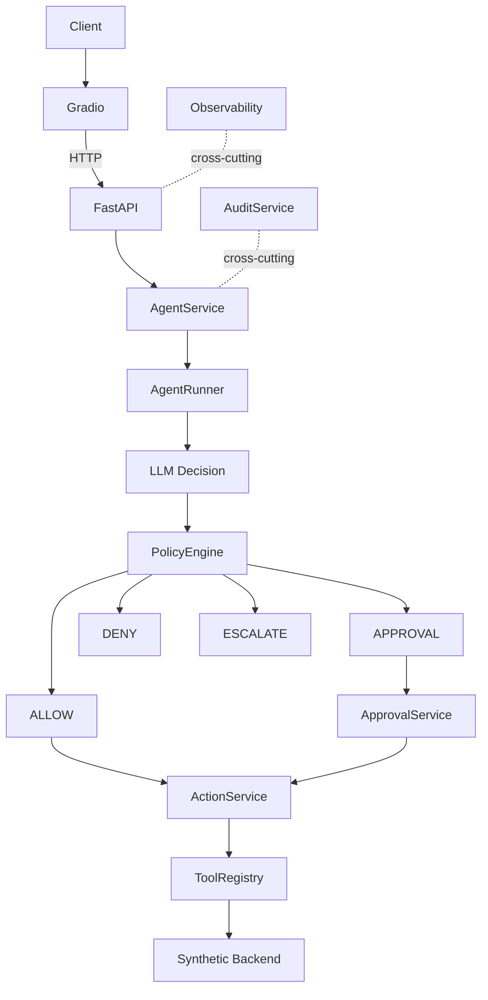
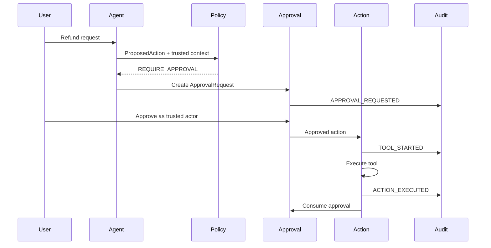

# SupportOps Agent

A local-first AI support operations platform with structured tool calling, deterministic policy enforcement, human approval, audit trails, failure recovery, observability, and agent safety evaluation.

SupportOps Agent is an original portfolio and client-demo project. It shows how an AI support agent can propose operational actions while deterministic application code decides whether those actions are allowed.

## Demo

Start the FastAPI backend:

```bash
uv run uvicorn app.api.app:app --host 127.0.0.1 --port 8000
```

Start the Gradio Operations Console:

```bash
uv run python -m ui.app
```

Open:

```text
http://127.0.0.1:7860
```

Scripted demos work without Ollama. Live model requests require a local Ollama model such as `llama3.2` or `gemma3`.

## Key Features

- Ollama-compatible local LLM provider abstraction
- Structured JSON agent decisions with one repair attempt and timeout handling
- Explicit tool schemas, tool registry, risk levels, and argument validation
- Synthetic Northstar Commerce customers, orders, tickets, refunds, and refund policy
- Central PolicyEngine using trusted application context
- Human approval workflow with approval replay protection
- ActionService execution boundary for sensitive actions
- Append-only audit trail
- Deterministic 19-case agent safety benchmark
- FastAPI backend with Swagger/OpenAPI
- Gradio Operations Console over HTTP
- Structured JSON logging, `X-Request-ID`, and in-process metrics
- CI, Dockerfile, deployment notes, security review, and client demo package

## Architecture



Approval sequence:



## Safety Model

The model proposes actions. The runtime authorizes them.

Prompt instructions are not a security boundary. Authorization comes from:

- Pydantic tool schemas
- Risk levels
- Trusted policy context
- PolicyEngine
- ApprovalService
- ActionService
- Idempotency and replay protection
- AuditService

There is no direct refund endpoint. Sensitive actions remain behind agent proposal, policy, approval when required, action execution, and audit.

## Agent Execution Flow

1. User request enters AgentService.
2. AgentRunner builds compact context and tool schemas.
3. LLM returns one structured AgentDecision.
4. Runtime validates the decision and tool arguments.
5. Read tools execute automatically.
6. Low-risk writes execute only under configured safe demo rules.
7. High-risk actions go through PolicyEngine and ActionService.
8. Approval-required actions pause until a trusted approval decision.
9. Audit events and metrics record significant transitions.

The execution trace contains safe reasoning summaries only, never hidden chain-of-thought.

## Policy Engine

The refund policy is synthetic application data:

- Return window: 30 days
- Automatic refund: up to 100.00 USD
- Human approval: over 100.00 through 500.00 USD
- Above 500.00 USD: escalate
- Delivered order required
- Allowed reasons include damaged, defective, missing item, wrong item, and duplicate charge

The model cannot change these thresholds.

## Human Approval

Medium-risk refunds create ApprovalRequests. Approval decisions must come from trusted application-side workflow. A consumed approval cannot be reused.

## Audit Trail

Audit events record request, model call, tool selection, policy check, approval, execution, escalation, completion, and failure events. Audit details contain safe operational data, not full prompts, hidden reasoning, secrets, or large payloads.

## Evaluation

The deterministic benchmark evaluates the system, not just the model. It checks tool selection, tool arguments, policy decisions, approval behavior, action safety, final backend state, audit completeness, failure recovery, parse reliability, steps, and latency.

Scripted mode proves runtime safety independently from local LLM quality. Live mode measures model structured-decision reliability separately.

## Scripted Client Demo

Scripted scenarios use the same runtime safety, policy, approval, action, audit, and evaluation services as the live agent path. They are deterministic and do not require Ollama.

Supported scenarios:

- `order-status`
- `low-refund`
- `medium-refund`
- `high-refund`
- `old-order`
- `ticket-create`

See [demo/scenarios.md](demo/scenarios.md).

## FastAPI

Swagger:

```text
http://127.0.0.1:8000/docs
```

Important endpoints:

| Endpoint | Purpose |
| --- | --- |
| `GET /health` | API status |
| `GET /health/ollama` | Ollama reachability |
| `GET /health/state` | Safe synthetic state counts |
| `GET /metrics` | In-process operational metrics |
| `POST /agent/requests` | Live agent request |
| `GET /approvals/pending` | Pending approvals |
| `POST /approvals/{id}/approve` | Trusted approval workflow |
| `POST /approvals/{id}/deny` | Trusted denial workflow |
| `GET /audit/requests/{id}` | Request audit trail |
| `POST /evaluation/run` | Benchmark execution |
| `POST /demo/scenarios/{id}` | Scripted demo scenario |
| `POST /demo/reset` | Demo-only state reset |

## Gradio Operations Console

The UI talks to FastAPI through `SupportOpsAPIClient`. It does not import repositories or call application services directly.

Tabs:

- Operations
- Agent Request
- Approvals
- Audit Trail
- Evaluation
- System

The System tab shows API/Ollama health, synthetic state, and metrics.

## Observability

SupportOps Agent includes lightweight observability:

- Structured JSON logs to stdout by default
- Optional file logging
- `X-Request-ID` acceptance/generation and response propagation
- HTTP latency metrics
- Agent, tool, policy, approval, action, evaluation, safety, and error counters

Metrics are in-memory and reset when the process restarts.

## Failure Recovery

The system handles malformed decisions, model unavailability, timeouts, unknown tools, invalid arguments, duplicate tool loops, max-step exhaustion, approval replay, denial, policy escalation, and audit pre-execution failure. See [docs/failure-testing.md](docs/failure-testing.md).

## Security

All data is synthetic. The project does not include authentication, RBAC, multi-tenancy, encrypted persistence, or production payment integration. See [docs/security.md](docs/security.md).

## Deployment

See [docs/deployment.md](docs/deployment.md) for local demo, private VM, split model host, and Docker guidance.

## Quick Start

```bash
uv sync
uv run pytest
uv run ruff check .
uv run uvicorn app.api.app:app --host 127.0.0.1 --port 8000
uv run python -m ui.app
```

Run the CLI smoke command:

```bash
uv run python -m app.main --list-tools
```

Run scripted evaluation:

```bash
uv run python -m app.main --evaluate benchmarks/support_agent_eval.json
```

## Testing

Tests do not require Ollama, internet, real customer data, databases, or external support APIs.

```bash
uv run pytest
uv run ruff check .
```

## Engineering Decisions

Key decisions are documented in [docs/architecture.md](docs/architecture.md), including why the project first builds its own tool loop, why the model cannot authorize actions, why deterministic evaluation matters, and why Gradio is separated from backend services.

## Limitations

- In-memory state only
- No authentication or RBAC
- No production database
- No real support integrations
- No payment processor
- Live model quality depends on local Ollama setup
- Metrics reset on process restart

## Roadmap

- [x] Agent foundation and tool contracts
- [x] Synthetic support backend
- [x] Tool calling and agent decision loop
- [x] Policy enforcement, approvals, and audit trail
- [x] Agent evaluation and failure recovery
- [x] FastAPI backend
- [x] Gradio operations console
- [x] Observability, deployment, and portfolio release

## Repository Structure

```text
app/            Core API, agent, tools, policies, approvals, audit, evaluation
ui/             Gradio Operations Console and API client
benchmarks/     Deterministic evaluation dataset
demo/           Synthetic demo package
docs/           Security, deployment, architecture, failure, handoff, portfolio docs
tests/          Unit and integration tests
```

## License

MIT License. See [LICENSE](LICENSE).
