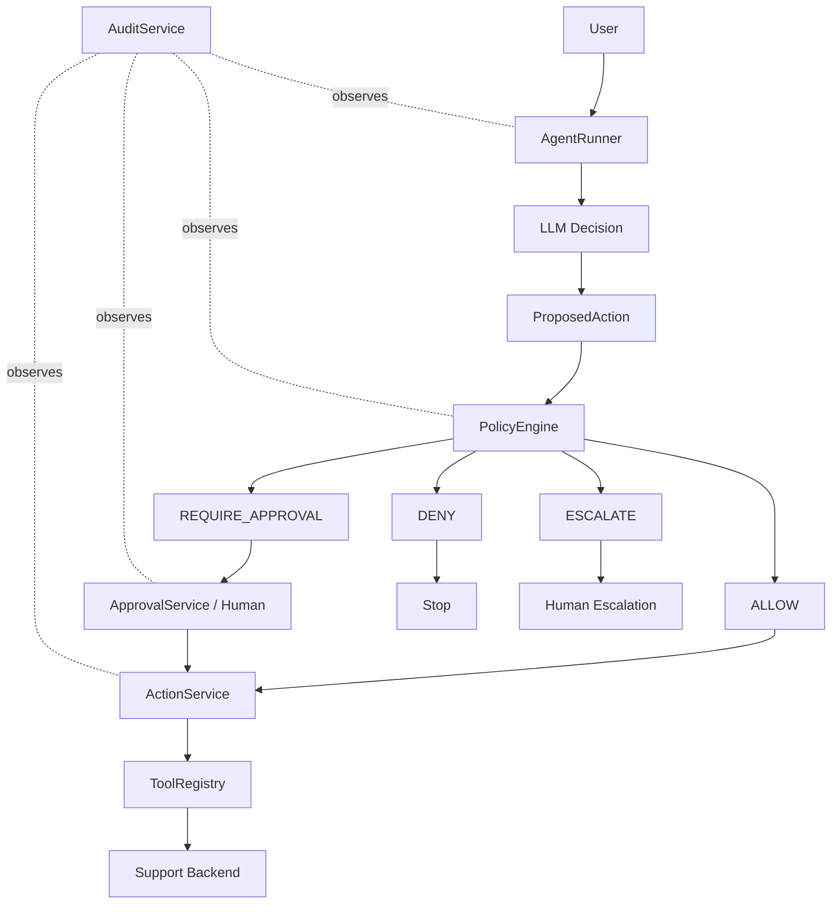

# SupportOps Agent

A local-first AI support operations agent focused on tool calling, policy enforcement, human approval, auditability, and safe automated actions.

## Overview

SupportOps Agent is an original portfolio and client-demo project for building an agentic support operations system from first principles. Phase 4 adds centralized policy enforcement, trusted human approvals, replay-protected action execution, and append-only audit events on top of the Phase 3 tool-using agent loop.

The LLM proposes actions. The runtime decides whether they may execute.

## Architecture



## Why Prompt Instructions Are Not Authorization

Prompt instructions are useful guidance, but they are not a security boundary. Authorization comes from trusted application code:

- trusted support data loaded by repositories
- deterministic policy rules
- explicit approval records created by `ApprovalService`
- replay checks on consumed approvals
- audited execution through `ActionService`

The model cannot approve its own action, forge approval, skip audit logging, alter policy thresholds, or execute high-risk tools directly.

## Policy Engine

`PolicyEngine` evaluates `ProposedAction` objects against a trusted `PolicyContext`. The context uses application data, not model assertions:

- customer id
- trusted order record
- stored refund policy
- current time
- previous refund totals
- tool risk level

Refund rules are explicit:

- order must exist
- order must belong to the customer when customer context exists
- order must be delivered
- delivery must be inside the 30-day return window
- refund reason must be allowed
- refund amount must be greater than zero
- refund amount must not exceed remaining refundable amount

Refund amount outcomes:

| Amount | Decision |
| --- | --- |
| `<= 100.00` | `ALLOW` |
| `> 100.00` and `<= 500.00` | `REQUIRE_APPROVAL` |
| `> 500.00` | `ESCALATE` |

Invalid reasons escalate for human review. Undelivered or outside-window orders are denied.

## Approval Workflow

`ApprovalService` owns trusted approval decisions. Approval requests store the proposed action, policy decision, status, request id, and consumption metadata.

Approvals are replay-protected:

- denied approvals cannot execute
- nonexistent approvals cannot execute
- approvals for different actions cannot execute
- consumed approvals cannot execute again
- approval decisions are application-side records, not model-generated booleans

## ActionService

`ActionService` is the only Phase 4 path for executing policy-controlled high-risk actions. It verifies policy, approval requirements, tool arguments, and audit logging before and after execution.

Auto-execution is intentionally narrow. `issue_refund` may auto-execute only when policy returns `ALLOW`. `reverse_refund` always requires approval.

## Audit Trail

`AuditService` appends events through an in-memory repository. Normal APIs do not delete or mutate historical events.

Events include:

- request received
- model called
- tool selected
- policy checked
- approval requested
- approval granted or denied
- tool started
- tool completed or failed
- action executed
- approval consumed
- escalation
- request completion or failure

Audit details contain safe structured metadata such as ids, statuses, decisions, amounts, tool names, and policy outcomes. They do not store hidden chain-of-thought.

## Reversal Policy

Refund reversal uses `reverse_refund`, preserves original refund records, creates a reversal record, restores totals, and is always approval-required in Phase 4.

## Structured Output Hardening

The agent still requires JSON-only decisions. If the model returns malformed JSON, the runner makes at most one repair attempt using `AGENT_DECISION_REPAIR_ATTEMPTS=1`. If repair fails, the request fails safely.

Local LLM calls use `LLM_TIMEOUT_SECONDS=90` through the Ollama/OpenAI-compatible client to avoid indefinite hangs.

## Synthetic Dataset

All records are fictional Northstar Commerce data:

- `CUS-1001` Jordan Lee, `ORD-1001`, Wireless Headphones, `79.99 USD`
- `CUS-1002` Morgan Chen, `ORD-1002`, Laptop Docking Station, `299.99 USD`
- `ORD-1003`, high-value `749.99 USD` escalation case
- older delivered order outside the return window
- shipped but undelivered order

Emails use `example.test`.

## CLI

Run the agent:

```bash
uv run python -m app.main --agent "My headphones arrived damaged. Can I get a refund?" --customer-id CUS-1001 --show-trace
```

Approval commands:

```bash
uv run python -m app.main --pending-approvals
uv run python -m app.main --approve <approval-id> --actor "demo-manager"
uv run python -m app.main --deny <approval-id> --actor "demo-manager" --comment "Not approved."
uv run python -m app.main --audit-request <request-id>
```

Because normal storage is in-memory and resets per CLI process, Phase 4 includes a single-process demo flow:

```bash
uv run python -m app.main --demo-approval-flow
uv run python -m app.main --demo-approval-flow --approve-demo
```

The demo creates a medium-value approval request and, with `--approve-demo`, executes it once and proves replay is blocked.

Support backend commands:

```bash
uv run python -m app.main --list-tools
uv run python -m app.main --customer CUS-1001
uv run python -m app.main --order ORD-1001
uv run python -m app.main --refund-policy
```

## Current Phase 4 Capabilities

- Centralized policy engine.
- Trusted refund policy context.
- Approval repository and service.
- Approval replay protection.
- Centralized action execution service.
- Append-only in-memory audit trail.
- AgentRunner integration for allow, approval, deny, and escalation outcomes.
- JSON repair attempt for malformed model decisions.
- LLM timeout configuration.
- Deterministic tests for policy, approvals, action execution, audit, and bypass protection.

## Known Limitations

- In-memory state resets between ordinary CLI processes.
- No external database yet.
- No FastAPI or Gradio UI yet.
- No production authentication or authorization layer yet.
- Live local model structured-output quality may vary.

## Quick Start

```bash
uv sync
uv run pytest
uv run ruff check .
uv run python -m app.main --demo-approval-flow --approve-demo
```

## Roadmap

1. Agent foundation & tool contracts [x]
2. Synthetic support backend [x]
3. Tool calling & agent decision loop [x]
4. Policy enforcement, approvals & audit trail [x]
5. Agent evaluation & failure recovery
6. FastAPI backend
7. Gradio operations console
8. Observability, deployment & portfolio release

## Security / Privacy

All records are synthetic. No real customer data, payment card data, authentication secrets, payment processor integration, external support API, or production database is used.

Do not commit `.env`, `.venv/`, logs, model caches, runtime approval/audit state, secrets, or unrelated files.
