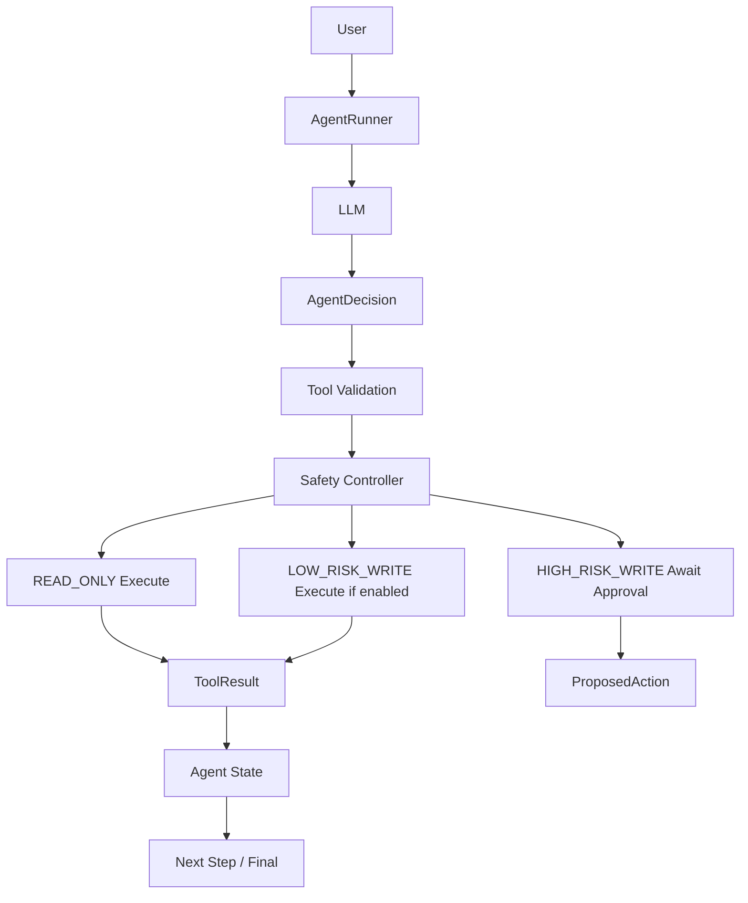
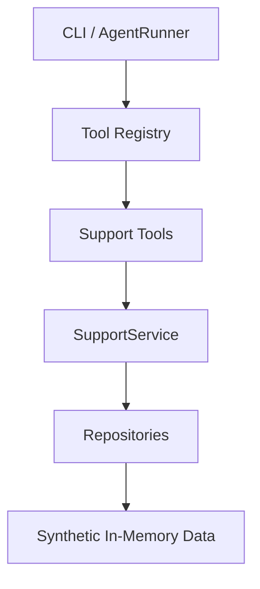

# SupportOps Agent

A local-first AI support operations agent focused on tool calling, policy enforcement, human approval, auditability, and safe automated actions.

## Overview

SupportOps Agent is an original portfolio and client-demo project for building an agentic support operations system from first principles. Phase 1 created the core agent and tool contracts. Phase 2 added a deterministic synthetic Northstar Commerce backend. Phase 3 adds the first complete tool-using agent decision loop.

The agent can now ask an LLM for one structured decision at a time, validate requested tools, apply runtime safety rules, execute allowed tools, observe results, and continue until completion, escalation, approval required, failure, or max steps.

## Architecture

Phase 3 decision loop:



Synthetic backend flow:



## Why The LLM Does Not Directly Execute Tools

The model only proposes a structured `AgentDecision`. The runtime is the execution boundary:

- validates the tool exists
- validates arguments with the tool input model
- checks tool risk level
- decides whether execution is allowed
- blocks high-risk writes from automatic execution

Prompt instructions are not a security boundary. Runtime safety enforcement is the security boundary. Even if the LLM requests `issue_refund`, the Phase 3 runtime refuses automatic execution and returns an approval-required result.

## Agent Decision Schema

The LLM must return JSON only. Supported decisions:

- `tool_call`
- `final_response`
- `escalate`
- `fail`

Each decision includes a short `reasoning_summary`. This is an externally safe rationale, not private step-by-step reasoning or hidden chain-of-thought.

Example:

```json
{
  "decision_type": "tool_call",
  "reasoning_summary": "The order must be retrieved before answering the status question.",
  "tool_name": "order_lookup",
  "tool_arguments": {
    "order_id": "ORD-1001"
  }
}
```

## Runtime Safety Gate

Tool risk behavior:

| Risk | Phase 3 Behavior |
| --- | --- |
| `READ_ONLY` | Executes automatically |
| `LOW_RISK_WRITE` | Executes only when `AGENT_ALLOW_LOW_RISK_WRITES=true` |
| `HIGH_RISK_WRITE` | Never auto-executes; creates `ProposedAction` and awaits approval |

High-risk tools currently include `issue_refund` and `reverse_refund`.

## Agent Loop Controls

- `AGENT_MAX_STEPS=8` prevents infinite loops.
- `AGENT_MAX_CONTEXT_CHARS=16000` bounds prompt context.
- `AGENT_MAX_IDENTICAL_TOOL_CALLS=2` catches repeated identical tool loops.
- Tool failures become safe observations instead of crashing the runner.
- Malformed model decisions fail safely with a structured error.

## Safe Execution Traces

The CLI can show a decision trace with `--show-trace`. It includes step number, decision type, safe reasoning summary, tool name, and result status. It does not print private chain-of-thought.

## Synthetic Support Backend

The backend remains fictional and deterministic:

- Jordan Lee, `CUS-1001`, `jordan.lee@example.test`
- `ORD-1001`, Wireless Headphones, `79.99 USD`, delivered on `2026-09-12`
- Morgan Chen, `CUS-1002`, `ORD-1002`, Laptop Docking Station, `299.99 USD`
- A high-value `749.99 USD` order for escalation scenarios
- An older delivered order outside the return-window scenario
- A shipped but not delivered order
- A multi-item order for future partial refund logic

All normal CLI runs start from seeded in-memory state.

## Support Tools

| Tool | Risk | Purpose |
| --- | --- | --- |
| `customer_lookup` | READ_ONLY | Fetch synthetic customer by ID |
| `customer_lookup_by_email` | READ_ONLY | Fetch synthetic customer by email |
| `order_lookup` | READ_ONLY | Fetch synthetic order details |
| `list_customer_orders` | READ_ONLY | List orders for a customer |
| `refund_policy_lookup` | READ_ONLY | View refund policy |
| `ticket_lookup` | READ_ONLY | Fetch a support ticket |
| `create_ticket` | LOW_RISK_WRITE | Create a synthetic support ticket |
| `update_ticket_status` | LOW_RISK_WRITE | Update synthetic ticket status |
| `issue_refund` | HIGH_RISK_WRITE | Propose a controlled synthetic refund |
| `reverse_refund` | HIGH_RISK_WRITE | Propose a synthetic refund reversal |

## CLI

Run the agent:

```bash
uv run python -m app.main --agent "What is the status of my order ORD-1001?" --customer-id CUS-1001 --show-trace
```

Run with model override:

```bash
uv run python -m app.main --agent "My headphones arrived damaged. Can I get a refund?" --customer-id CUS-1001 --model gemma3 --show-trace
```

JSON output:

```bash
uv run python -m app.main --agent "What is the status of my order ORD-1001?" --customer-id CUS-1001 --output json
```

Support backend commands:

```bash
uv run python -m app.main --list-tools
uv run python -m app.main --customer CUS-1001
uv run python -m app.main --order ORD-1001
uv run python -m app.main --refund-policy
```

Manual controlled tool execution still requires `--confirm-write` for write tools.

## Current Phase 3 Capabilities

- Structured `AgentDecision` model.
- JSON-only parser with fenced JSON support and clean parse errors.
- Prompt builder with tool schemas and runtime safety instructions.
- Bounded context builder preserving the original request and recent observations.
- AgentRunner with tool validation, safety checks, observations, max-step guard, and duplicate-call protection.
- AgentService for high-level request handling.
- CLI support for agent runs, JSON output, and safe execution traces.
- Tests proving high-risk refund tools cannot execute automatically.

## Known Limitations

- No centralized policy engine yet.
- No human approval execution workflow yet.
- No persistent audit log yet.
- No FastAPI or Gradio UI yet.
- LLM output quality depends on the local model, but malformed output is handled safely.

## Technology Stack

Runtime:

- Python 3.12+
- uv
- Ollama
- OpenAI-compatible Ollama endpoint
- OpenAI Python SDK
- Pydantic
- pydantic-settings
- python-dotenv

Development:

- pytest
- Ruff

## Quick Start

```bash
uv sync
uv run pytest
uv run ruff check .
uv run python -m app.main --agent "What is the status of my order ORD-1001?" --customer-id CUS-1001 --show-trace
```

## Planned Roadmap

1. Agent foundation & tool contracts [x]
2. Synthetic support backend [x]
3. Tool calling & agent decision loop [x]
4. Policy enforcement, approvals & audit trail
5. Agent evaluation & failure recovery
6. FastAPI backend
7. Gradio operations console
8. Observability, deployment & portfolio release

## Security / Privacy

All records are synthetic. The project uses `example.test` email addresses only. Refund behavior is simulated in memory. No card data, payment processor integration, database, external support API, authentication secret, or real customer data is used.

Do not commit `.env`, `.venv/`, logs, model caches, runtime audit data, secrets, or unrelated files.
